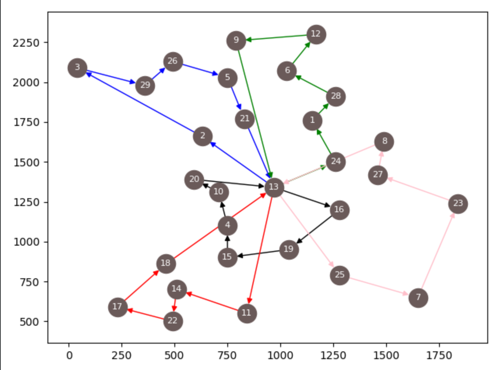

# MTSP_ACO

This repository is the repository which implements mTSP (multi Traveling Salesman Problem) with ant colony optimization.
Referenced paper is [here](https://www.researchgate.net/publication/220792786_An_Ant_Colony_Optimization_Algorithm_for_Multiple_Travelling_Salesman_Problem).



# Algorithm

This mTSP will try to solve multi salesman problem with ant colony optimization.

`n`: cities (1 is a start node(default))

`m`: number of salesman

This mTSP will start `num_of_ants` ant's will start  node.
And, each ant will make `m` paths that, each path will contain `(n-1) / m` cities.
So, each ant will make m-salesman path, each path has different nodes.

For example, if n = 10, m = 3, k(num_of_ants) = 6,

ant_1 = [[1, 2, 3, 4], [1, 5, 6, 10], [1, 7, 8, 9]]
ant_2 = [[1, 4, 10, 3], [1, 5, 7, 8], [1, 2, 6, 9]]
...
ant_6 = [...]

And `num_of_ants` made the each m paths, we score the length in each path,
and as usually, we make pheromones and accumulate it on the path ant routes.

This repository doesn't use MMAS, so

- mTSP
- 2-opt

use as techniques.

# How to use

main.py

```python
import tsplib95
import matplotlib.pyplot as plt
import networkx as nx
import random

from colony import Colony
from solver import Solver

problem = tsplib95.load_problem('bays29.tsp')
G = problem.get_graph()

solver = Solver()
colony = Colony(1, 3)

# num of sales
sales = 5

# start is the start node, and limit is max cycles, opt2 is times how to try opt2
# if opt2 is None, don't try opt2.
ans = solver.solve(G, colony, sales, start=13, limit=50, opt2=20)
print(sum(s.cost for s in ans), ans)

# draw
colors = ['black', 'blue', 'green', 'red', 'pink', 'orange']
plt.figure(dpi=300)
_, ax = plt.subplots()
pos = problem.display_data or problem.node_coords
nx.draw_networkx_nodes(G, pos=pos, ax=ax, node_color=(0.4157, 0.3529, 0.3490))
nx.draw_networkx_labels(G, pos=pos, labels={i: str(i) for i in range(1, len(G.nodes) + 1)}, font_size=8, font_color='white')
for i in range(len(ans)):
    solution = ans[i]
    path = solution.path
    nx.draw_networkx_edges(G, pos=pos, edgelist=path, arrows=True, edge_color=colors[i])
    # nx.draw_networkx_edges(G, pos=pos, edgelist=path, arrows=True, edge_color=[random.random() for i in range(3)])

# If this doesn't exsit, x_axis and y_axis's numbers are not there.
ax.tick_params(left=True, bottom=True, labelleft=True, labelbottom=True)
plt.show()

```


# Thanks

This repository refers to [acopy](https://github.com/rhgrant10/acopy).
Please read this documentation and implemantiaon.

If MTSP_ACO has bad implementation or issue, please feel free to contact me and issue.

